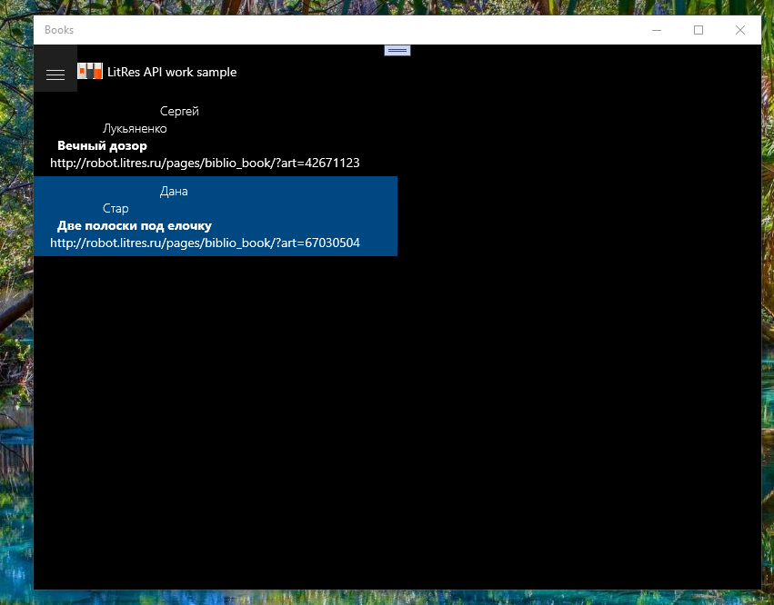

# Books: Litres Books communication sample

## Description 

Shows how to implement an Litres Books read (fetch) data application. 
This app is UWP sample.

## Screenshots

## System requirements

**Hardware:** Lumia 950/950XL (and newer for phone/proto)

**Phone os:** Windows 10 Mobile (min os build - 15063)

## Description
This repository is LitRes App prototype (draft, sketch) made with UWP tech. 
This app cannot write data, but reads some my book collection/library parameters...  

# Contribute!
There's still a TON of things missing from this proof-of-concept (MVP) and areas of improvement 

With best wishes,

  [m][e] 2022

## Thanks!
I wanted to put down some thank you's here for folks/projects/websites that were invaluable 
for helping me get this project into a functional state:
- [Microsoft UWP Samples](https://github.com/microsoft/windows-universal-samples/) Good (
but too late, heh!) example of NFC UWP app, by Microsoft!)

Books is RnD project only. AS-IS. No support. Distributed under the MIT License.

